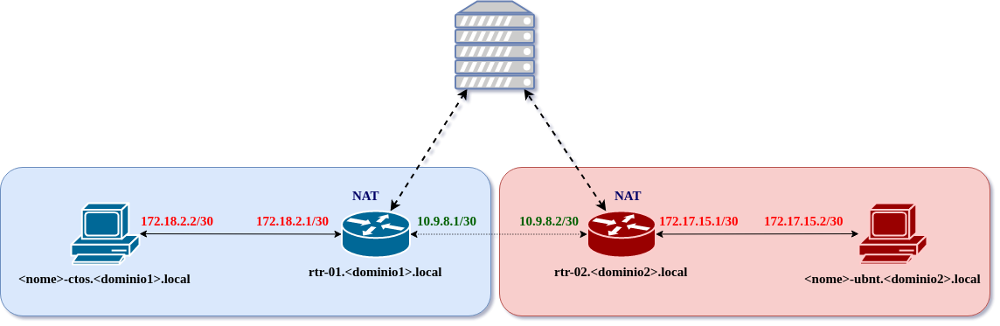

## Topologia

[Laboratório 01](S01/index.md): 

* Configurações básicas de rede e roteamento
* Introdução a análise de pacotes e identificação de serviços

[Laboratório 02](S02/index.md):

* Configurações do Apache
* Testes de conectividade entre os serviços

[Laboratório 03](S03/index.md):

* Configurações do LDAP
* Testes de autenticação no LDAP

[Laboratório 04](S04/index.md):

* Configurações do Samba
* Utilizar o Samba como repositório de arquivos

[Objetivos01](S04/objetivos01.md) | [Respostas](S04/respostas01.md)

[Laboratório 05](S05/index.md):  

* Configurações do Postfix
* Testes de envio de e-mail entre as máquinas

[Objetivos 01](S05/objetivos01.md) | [Respostas](S05/respostas01.md)

[Laboratório 06](S06/index.md):  

* Configurações do Postfix
* Testes de envio de e-mail entre as máquinas

[Objetivos 01](S06/objetivos01.md) | [Respostas](S06/respostas01.md)

[Laboratório 07](S07/index.md):  

* Docker

[Objetivos 01](S07/objetivos01.md) | [Respostas](S07/respostas01.md)
[Objetivos 02](S07/objetivos02.md) | [Respostas](S07/respostas02.md)

[Laboratório 08](S08/index.md):  

* docker-compose
* Fazer deploy de aplicações utilizando docker-compose

[Objetivos 01](S08/objetivos01.md) | [Respostas](S08/respostas01.md)
[Objetivos 02](S08/objetivos02.md) | [Respostas](S08/respostas02.md)
[Objetivos 03](S08/objetivos03.md) | [Respostas](S08/respostas03.md)
[Objetivos 04](S08/objetivos04.md) | [Respostas](S08/respostas04.md)

